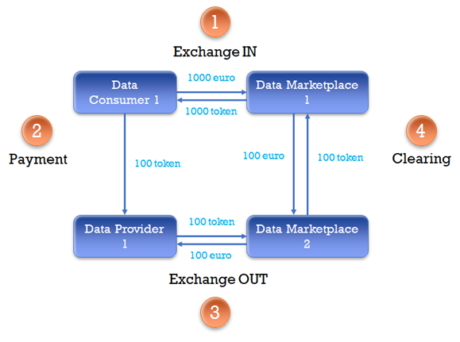

# Treasury Smart Contract

This repository contains te smart contact that define and maintains the token strategy for the i3-market ecosystem.



The smart contract is based on the ERC1155 standard in order to deploy a gas-efficient token contract.   
The Treasury smart contract is used to represent multiple marketplaces tokens at once.

## Getting started

Just read this README using any plain text editor.

## How to build and deploy

This section explains step by step how to deploy anf interact with the Treasury smart contract deployed in a Truffle 
test network. The step by step guide is intended to be run on an Ubuntu 20.04 system.

## Build
This section explains 

### Requirements
- Git
- Nodejs
- Truffle


#### Installing git

```shell
$ sudo apt update
$ sudo apt install git
```

Verify the installation 
```shell
$ git --version
```

#### Installing Nodejs environment

This section explains how to install and use the Node Version Manager tool (nvm) to manage the needed Nodejs 
environment and dependencies.  

Installing nvm v0.39.0, to install the latest version check the
[official documentation.](https://github.com/nvm-sh/nvm#installing-and-updating)
```shell
$ curl -o- https://raw.githubusercontent.com/nvm-sh/nvm/v0.39.0/install.sh | bash
$ wget -qO- https://raw.githubusercontent.com/nvm-sh/nvm/v0.39.0/install.sh | bash
```

Initializing in current shell
```shell
$ source ~/.bashrc
```

Installing node  
```shell
$ nvm install lts/gallium
```

#### Installing Truffle

Truffle creates a development and testing environment for Ethereum network for more information visit the official site
of [truffle suite](https://trufflesuite.com/)

```shell
$ npm install -g truffle
```

### Cloning the repository
```shell
$ git clone https://gitlab.com/i3-market/code/wp3/t3.3/tokenization.git
$ cd tokenization
```

### Installing Nodejs dependencies
```bash
$ npm install
```

## Deploy in develop network
This section contains how to deploy the smart contracts in a private eht chain created by the truffle framework.

Run truffle develop chain.
```shell
$ truffle develop
```

Compile and deploy the Treasury smart contract in develop network.
```shell
truffle(develop)> migrate
```

## Testing

To test the Treasury smart contract is needed to have the 
[**_Requirements described in the Build section_**](###requirements) installed. Once that the requirements are 
installed. The Treasure smart contract can be tested using the Truffle framework. To do that, inside the project folder
init the Truffle framework.

```shell
$ truffle develop
```

Run the test command
```shell
truffle(develop)> test
```
The framework will compile, test and show the summary of testing the smart contracts.


## Credits

This repository has been created by:

Luca Marangoni (GFT) <Luca.Marangoni@gft.com>  
Germán Molina (HOPU) <german@hopu.org>


## License

```

This is free and unencumbered software released into the public domain.


Anyone is free to copy, modify, publish, use, compile, sell, or

distribute this software, either in source code form or as a compiled

binary, for any purpose, commercial or non-commercial, and by any

means.


In jurisdictions that recognize copyright laws, the author or authors

of this software dedicate any and all copyright interest in the

software to the public domain. We make this dedication for the benefit

of the public at large and to the detriment of our heirs and

successors. We intend this dedication to be an overt act of

relinquishment in perpetuity of all present and future rights to this

software under copyright law.


THE SOFTWARE IS PROVIDED "AS IS", WITHOUT WARRANTY OF ANY KIND,

EXPRESS OR IMPLIED, INCLUDING BUT NOT LIMITED TO THE WARRANTIES OF

MERCHANTABILITY, FITNESS FOR A PARTICULAR PURPOSE AND NONINFRINGEMENT.

IN NO EVENT SHALL THE AUTHORS BE LIABLE FOR ANY CLAIM, DAMAGES OR

OTHER LIABILITY, WHETHER IN AN ACTION OF CONTRACT, TORT OR OTHERWISE,

ARISING FROM, OUT OF OR IN CONNECTION WITH THE SOFTWARE OR THE USE OR

OTHER DEALINGS IN THE SOFTWARE.


For more information, please refer to <http://unlicense.org/>

```

 
